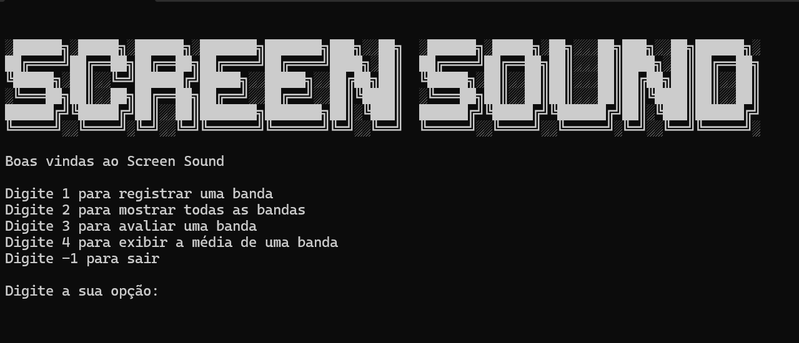

# Screen Sound

## Descrição
O Screen Sound é um aplicativo simples de linha de comando desenvolvido em C# e .NET. Ele permite que você registre bandas de música, atribua notas a elas, liste as bandas registradas e veja a média das notas atribuídas.

## Instalação
1. Baixe a pasta Screen Sound app.
2. Execute o arquivo `ScreenSound.exe`.
3. Siga as instruções fornecidas pela aplicação após a execução para começar a usá-la.

## Uso

### Comandos Disponíveis
- `registrar`: Registra uma nova banda de música.
- `avaliar`: Atribui uma nota a uma banda registrada.
- `mostrar`: Lista todas as bandas registradas.
- `media`: Calcula a média das notas atribuídas às bandas.
- `sair`: Encerra a aplicação.

## Tecnologias Utilizadas
- C#
- .NET
